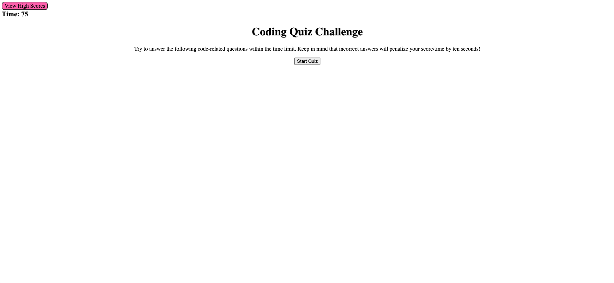
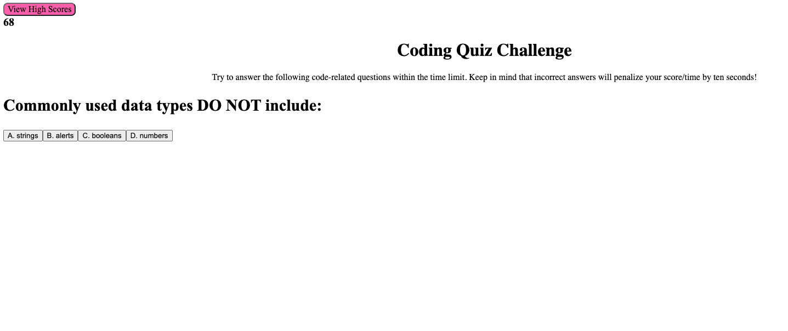

# Code-Quiz

# Description
This application is a coding quiz that presents the user with a series of multiple choice questions. The code quiz is timed, and once the user clicks on 'Start Quiz' a countdown timer will begin. Each time a user get a question wrong, time will be deducted. If the user answers all questions or the timer runs out, the user can then save their quiz score with their initials.

# View Application Here: 

# User Story
AS A coding boot camp student
I WANT to take a timed quiz on JavaScript fundamentals that stores high scores
SO THAT I can gauge my progress compared to my peers

# Acceptance Criteria
GIVEN I am taking a code quiz
WHEN I click the start button
THEN a timer starts and I am presented with a question
WHEN I answer a question
THEN I am presented with another question
WHEN I answer a question incorrectly
THEN time is subtracted from the clock
WHEN all questions are answered or the timer reaches 0
THEN the game is over
WHEN the game is over
THEN I can save my initials and score

# Technologies Used
 * HTML
 * CSS 
 * JavaScript

# Screenshots of Application

* Start Screen 

* Question Screen
